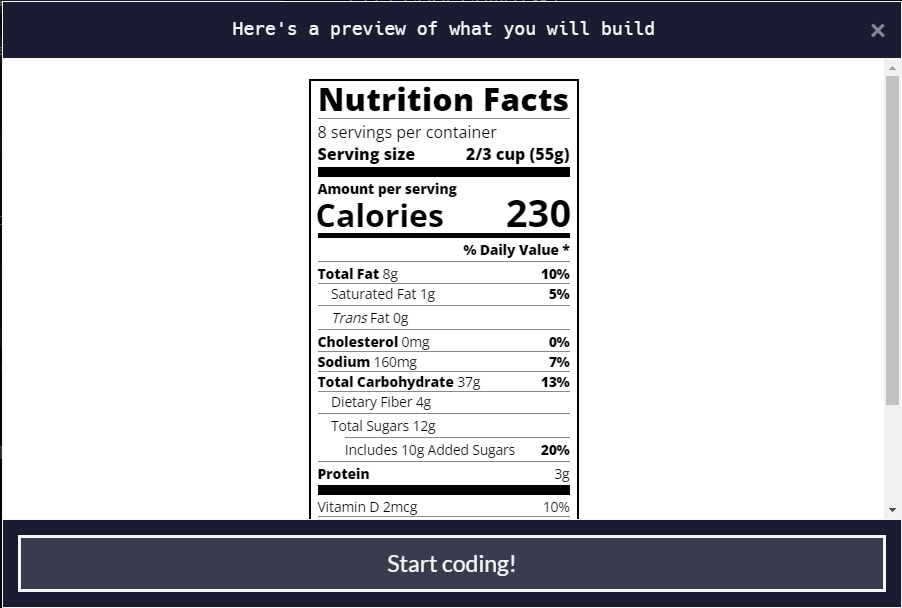
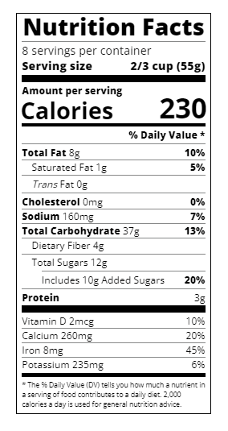

# Learn Typography by building a Nutrition label.

> Typography is the art of styling your text to be easily readable and suit its purpose.

*In this course, you'll use typography to build a nutrition label webpage. You'll learn how to style text, adjust line height, and position your text using CSS.*

