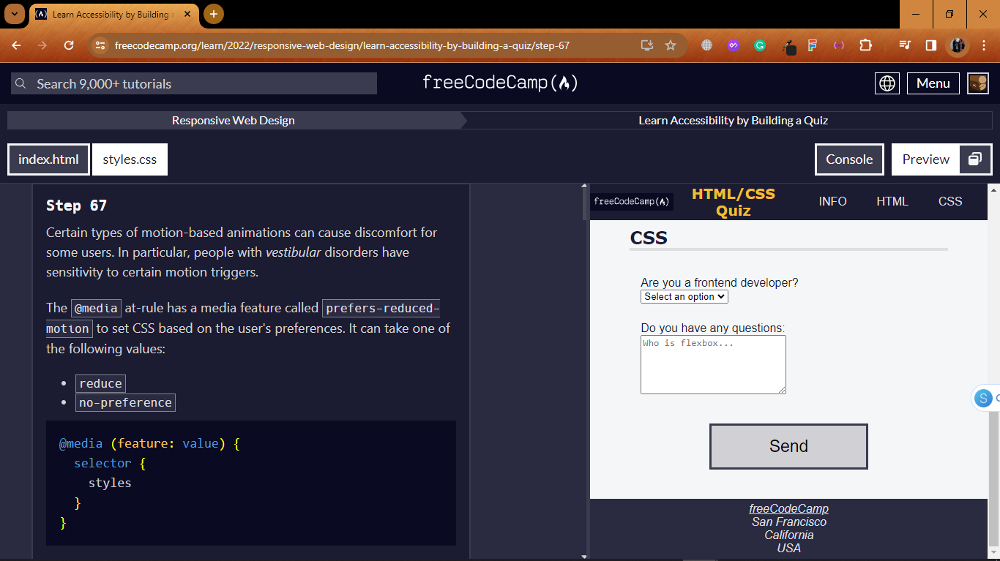

# <u>Learn Accessibility by building a Quiz. </u>

### Accessibility is making your webpage easy for all people to use – even people with disabilities.

> In this course, you'll build a quiz webpage. You'll learn accessibility tools such as keyboard shortcuts, ARIA attributes, and design best practices

<video width="1000" height="400" controls>
<source src="./accessibility-with-a-quiz.mp4" type="video/mp4">
Learn Accessibility by building a Quiz
</video>

Step 1
Welcome to the first part of the Accessibility Quiz. As you are becoming a seasoned HTML and CSS developer, we have started you off with the basic boilerplate.

Start this accessibility journey by providing a lang attribute to your html element. This will assist screen readers in identifying the language of the page.

<h3> Step 67 </h3>

<h3>End of the Course</h3>

